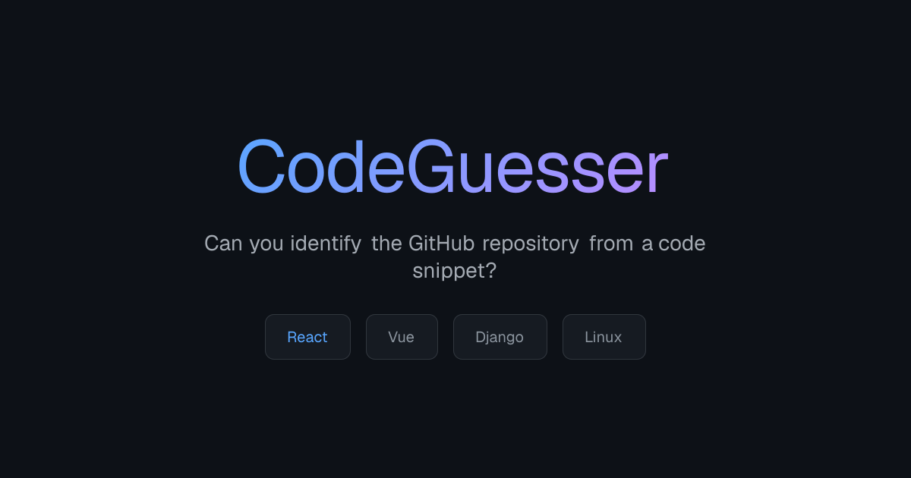

# CodeGuesser 🎯

CodeGuesser is a fast-paced, interactive web game that challenges developers to identify popular open-source repositories from small code snippets.

**Play now at [codeguesser.xyz](https://www.codeguesser.xyz)**



## 🚀 Features

- **Random Challenges:** Code snippets are fetched dynamically from a curated list of popular GitHub repositories.
- **Modern UI:** A sleek, dark-themed interface with glassmorphism effects and fluid animations.
- **Local History & Stats:** Tracks your performance (accuracy and rounds played) using local storage.
- **Responsive Design:** Optimized for both desktop and mobile play.
- **Real-time Feedback:** Interactive "shake" and "pulse" animations for incorrect and correct guesses.

## 🛠️ Tech Stack

- **Framework:** [Next.js 15+](https://nextjs.org/) (App Router)
- **Language:** [TypeScript](https://www.typescriptlang.org/)
- **API:** [GitHub REST API](https://docs.github.com/en/rest)
- **Styling:** Vanilla CSS (Modern CSS features, Keyframe animations)
- **Code Highlighting:** [react-syntax-highlighter](https://github.com/react-syntax-highlighter/react-syntax-highlighter)
- **Testing:** [Vitest](https://vitest.dev/)
- **Analytics:** Google Analytics 4

## 🛠️ Local Development

### Prerequisites

- Node.js 18+
- A GitHub Personal Access Token (optional, but recommended to avoid rate limits)

### Setup

1. **Clone the repository:**
   ```bash
   git clone https://github.com/nweiler/code-guesser.git
   cd code-guesser
   ```

2. **Install dependencies:**
   ```bash
   npm install
   ```

3. **Configure Environment Variables:**
   Create a `.env.local` file in the root directory:
   ```env
   GITHUB_TOKEN=your_github_token_here
   ```

4. **Run the development server:**
   ```bash
   npm run dev
   ```
   Open [http://localhost:3000](http://localhost:3000) with your browser to see the result.

## 🧪 Testing

Run the test suite using Vitest:
```bash
npm test
```

## 📜 License

This project is open-source and available under the [MIT License](LICENSE).

---
Built with ❤️ by [Nick Weiler](https://github.com/nweiler)
